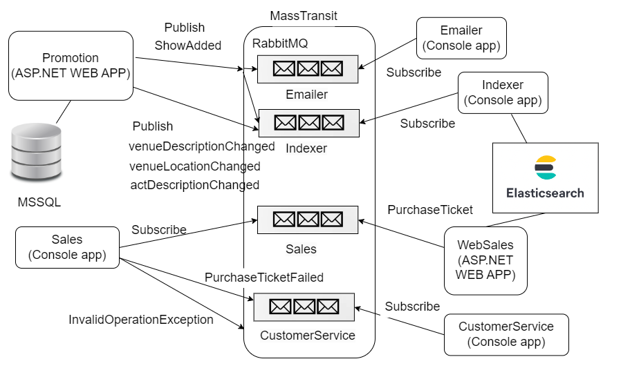
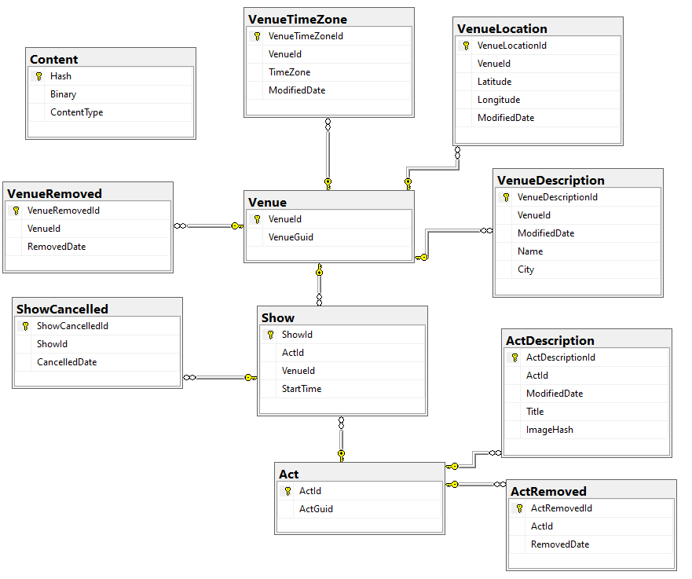

# GloboTicket App - Microservices Architecture

## System architecture



## Dependencies

- MSSQL Server
- RabbitMQ
- Elasticsearch

## Development environment setup with Docker-Compose

```dotnetcli
docker-compose up -d --build
```

### Elasticsearch UI

Access options:

- Chrome extension: https://chrome.google.com/webstore/detail/elasticvue/hkedbapjpblbodpgbajblpnlpenaebaa?hl=en
- Visit [http://localhost:9200](http://localhost:9200) in your browser to verify that it is running.
  Then schedule a show in the Promotion Web application and query Elasticsearch at [http://localhost:9200/shows/\_search?pretty](http://localhost:9200/shows/_search?pretty).

### RabbitMQ container:

You can access the GUI in the browser: http://localhost:15672/

### MSSQL Server container (with volumes to persist data):

You can connect to it with:

- SQL Server Management Studio or Azure Data Studio
- DataGrip
- Visual Studio
- etc.

## Database connection string (Promotion microservice) - different options

Different environments will require different connection strings.

### Using Docker MSSQL Server container (the default for this project)

We are refferencing the container service mssql-2019 defined in the docker-compose.yml file.

```json
{
  "ConnectionStrings": {
    "PromotionContext": "Server=mssql-2019,1433;Database=PromotionContext-v1;User Id=sa;Password=Pass@word1;MultipleActiveResultSets=true"
  }
}
```

### Using LocalDB (for development)

```json
{
  "ConnectionStrings": {
    "PromotionContext": "Server=(localdb)\\mssqllocaldb;Database=PromotionContext;Trusted_Connection=True;MultipleActiveResultSets=true"
  }
}
```

### Using a local MSSQL Server

If you are using a local MSSQL Server then you need to update your connection string to this:

```json
{
  "ConnectionStrings": {
    "PromotionContext": "Server=localhost\\SQLEXPRESS;Database=PromotionContext;Trusted_Connection=True;MultipleActiveResultSets=true"
  }
}
```

## MSSQL Database (for the Promotion microservice)

The Promotion microservice will automatically run the migrations to create the database schema when it starts:

startup.cs:

```csharp
using (var scope = app.ApplicationServices.CreateScope())
{
    var db = scope.ServiceProvider.GetRequiredService<PromotionContext>();
    db.Database.Migrate();
}
```

### Working with Entity Framework Core migrations:

Install the EF command-line tools in order to work with the application database. NOTE: we need version 5 compatible with .NET 5.
Run this command:

```bash
dotnet tool install --global dotnet-ef --version 5.0.0
```

Initialize the application database by running migrations.
Use the following command in the terminal powershell:

```bash
dotnet ef database update --project GloboTicket.Promotion/
```

or in Visual Studio Package Manager Console:

```powershell
Update-Database -Project GloboTicket.Promotion
```

### Database ERD



## Microservices overview

### Promotion Web Application

- The Promotion Web application is the main entry point for scheduling shows.
- It connects to the MSSQL database to store show information and it sends messages to RabbitMQ when a new show is scheduled.
- It can also create, update and delete venues and acts. It will also send messages to RabbitMQ when venues or acts are created, updated or deleted.

## Emailer

The Emailer is a mock service that stands in for a process that emails about new shows ( it only outputs to the console).
It requires RabbitMQ to be running because it listens for messages about new shows in order to simulate sending email notifications.

Start the Emailer and schedule a show in the Promotion Web application. You should see the Emailer output in the console verifying that it received the message and sent the notification.

## Indexer

The Indexer listens for messages from the Promotion Web application about changes in the MSSQL database and it updates Elasticsearch database.
Depends on RabbitMQ and Elasticsearch.

## Web Sales

The Web Sales application is the main entry point for customers to purchase tickets for shows.
It connects to Elasticsearch to get show information and it sends messages to RabbitMQ when a customer purchases tickets for a show.
NOTE: It is a mock application - it does not even connect to the Elasticsearch database to get show information. It only simulates the process of purchasing tickets with a mock web site.

## Sales

The Sales microservice listens for messages from the Web Sales application about ticket purchases.
It just simulates different scenarios - successful purchase, failed purchase due to insufficient tickets, etc.

## Customer Service

The Customer Service microservice listens for messages from the Sales microservice about ticket purchase failures.
It just simulates the process of handling failed ticket purchases by outputting to the console.
